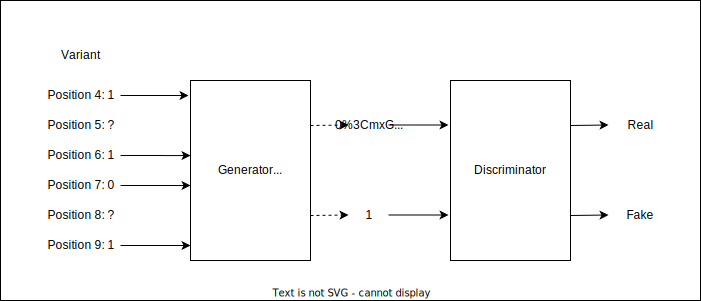

# A rapid and reference-free imputation method for low-cost genomic applications

# clone from GRUD : https://github.com/vinhdc10998/GRUD/ with some modification in model.

### Add GRUModel_improve class with replace GRU by BiLSTM modules in gru_model.py and CustomDiscriminator class in grud_model.py to input MLP list instead of single dense layer.

## Overview


This repository contains a Python implementation of GRUD model, which is a genotype imputation based on deep learning algorithms. In specific, GRUD is composed of two components: *Generator* and *Discriminator*. The generator model undertakes a mission to create tokens, and the discriminator tries to verify tokens created by the generator model. In the current study, we assumed that unobserved variants are tokens in natural languages which would be predicted from a known paragraph of observed variants. In addition to, our approach resolves the reference panel privacy problem while improving both the accuracy and running time. 

If you have any feature requests or questions, feel free to leave them as GitHub issues!
## REQUIREMENT

- Python = 3.8.8
- Python packages:
  - NumPy
  - Scikit-learn
  - PyTorch

```script
pip install -r requirements.txt
```

## EXAMPLE USAGE

### Dataset
In this repository, the example dataset which is used to train and evaluation is 1000 Genome Project (1KGP) phase3 integrated dataset for chromosome22.

Download: https://drive.google.com/drive/folders/17RIdXWoIKJsxjzfYmSmvW19kaQHxoafC?usp=sharing
- Type of input data:
  - Phased genotype with HAP/LEGEND format ( For details, please see https://github.com/kanamekojima/rnnimp)
  - Weighted of trained model
- Type of output data:
  - Genotype imputation results in Oxford GEN format

### Imputation
For example, GRUD model imputes genotypes for small regions (1-10) separately

```script
python eval.py  --root-dir <path of LENGEND/HAP files> \
                --model-config-dir <path of config model files> \
                --model-type dis \
                --batch-size 128 \
                --regions 1-10 \
                --model-dir <path of weighted model files> \
                --gpu 2 \ 
                --result-gen-dir <path of output files> \
                --best-model
```

### Training
We provides small regions of chromosome 22 for training 1KGP data.

```script
python train.py --root-dir <path of LENGEND/HAP files> \
                --model-type dis \
                --model-config-dir <path of config model files> \
                --batch-size 128 \
                --epochs 100 \
                --chr chr22 \
                --lr 0.001 \
                --output-model-dir <output path of weighted model files> \
                --early-stopping \
                --gpu 0 \
                --region 1-10
```

Be aware of CustomDiscriminator class in model/grud.py

## Arguments
| Args | Default | Description |
| :--- | :--- | :--- |
| --model-type STR | None | Type of model |
| --root-dir STR | None | Data folder |
| --model-config-dir STR | None | Config model folder |
| --gpu STR | None | GPU's Id |
| --batch-size INT | 2 | Type of model |
| --regions STR | 1 | Range of regions |
| --chr STR | chr22 | Chromosome |
| --model-dir STR | model/weights | weight model folder |
| --result-gen-dir STR | results/ | result folder |
| --dataset STR| None | Custom dataset |
| --lr FLOAT| 1e-4 | learning rate |
| --output-model-dir STR| None | Custom dataset |
| --early-stopping BOOL | False | Early stopping |
| --best-model BOOL| False | Get best model to test |

## CONTACT
Developer: Duong Chi Vinh, GeneStory

E-mail: vinh.duong [AT] genestory [DOT] ai
